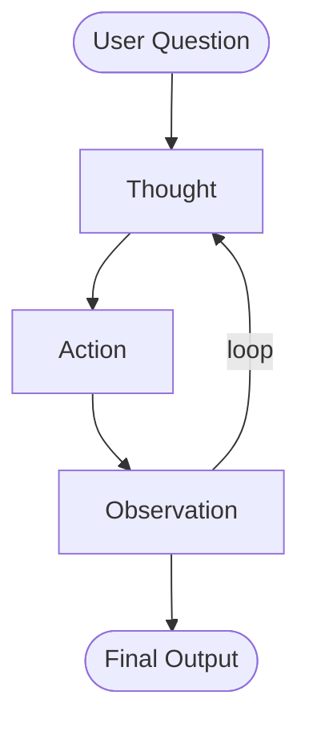

# Single AI Agents

## Agent = LLM + Tools + Knowledge + Memory

- An AI Agent is a program that takes input, thinks and acts to complete a task in an autonomous way using tools, memory and knowledge.

## Two important characteristics of an AI Agent

1. Uses LLM as its Brain.
2. Autonomy.

Autonomy means an agent can

    - read and write files
    - delete and create things
    - read and send emails
    - make bank investments

As an agent gets more Autonomous, it also gets less predictable.

## ReAct Loop - workflow followed by all agents in same way

> ReAct = Reason + Act

